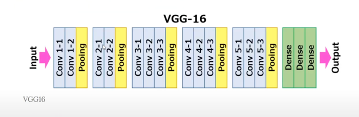

## Youtube

- [Create layers | Computer Vision with Keras p.1](https://www.youtube.com/watch?v=wjL05_yBzr0)

- [Build a Sequential model | Computer Vision with Keras p.2](https://www.youtube.com/watch?v=O3Y-FcucCe4)

- [Conv2D Layer | Computer Vision with Keras p.3](https://www.youtube.com/watch?v=1GXgllswEeo)

- [Feature map | Computer Vision with Keras p.4](https://www.youtube.com/watch?v=RPoAJ_J2Wno)

- [Max pooling layer | Computer Vision with Keras p.5](https://www.youtube.com/watch?v=Auy-t_zNORI)

- [Flatten and Dense layers | Computer Vision with Keras p.6](https://www.youtube.com/watch?v=ImOdTlxkxm8)

- [Image Classification model VGG16 from scratch | Computer Vision with Keras p.7](https://www.youtube.com/watch?v=j05JpWO85_o&list=TLPQMDgwOTIwMjQZ7vo5V6XtTQ&index=2)

